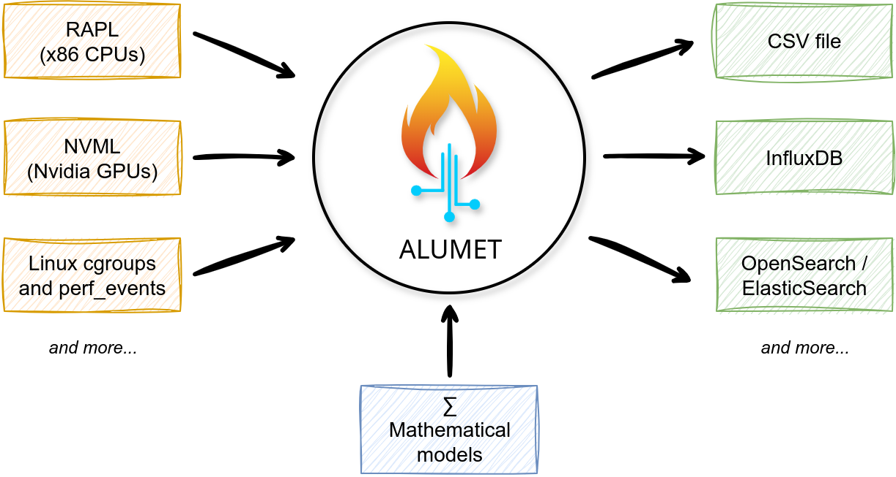
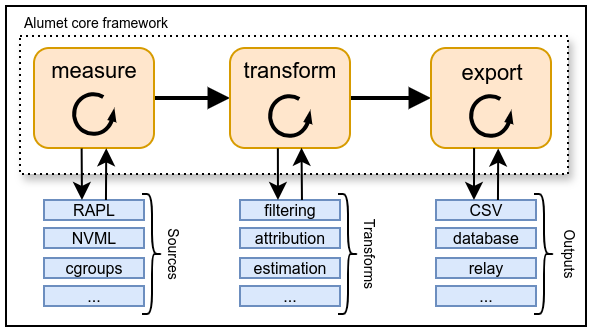
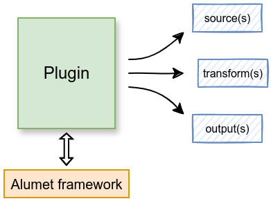
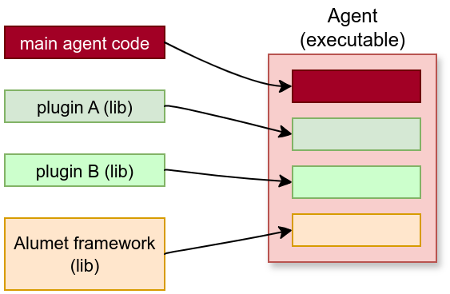

Before writing code, let's understand what we are working on.

## Measurement Pipeline

The following diagram, copied from the user book, shows a simplified view of what Alumet does.

From the perspective of a user, Alumet is a tool that gathers measurements from sources (on the left), performs some computations ("models"), and export the data (on the right).
For instance, Alumet can measure the energy consumption of your CPU and GPU. With some formulas, it can estimate the energy consumed by a particular process or Kubernetes pod.
It can then write the measured and estimated values to a file or database.

This is a functional view that suits users well.
But you, a developer, need to go behind the scenes! Here is another diagram that shows the (high-level) internal design of Alumet.

As you can see, the core of Alumet contains an extensible measurement pipeline with tree steps (in orange):
1. obtain measurements from the sources
2. transform the measurements
3. write the data to the outputs

Alumet is a generic framework, and its pipeline is entirely agnostic to the hardware components and software platform.
By itself, it contains no sources, no transform functions (or "transforms"), and no outputs.
These pipeline elements (in blue) are provided by **plugins**.

## Plugins

An Alumet plugin is a software component that is added on top of the Alumet framework.
It can act on the measurement pipeline, for instance by registering new pipeline elements (in blue in the diagram above).

Follow the [plugin tutorial](../plugins/tutorial/0_intro.md) to start writing plugins.

## Agents

An Alumet agent is an executable binary that combines the framework, some plugins and some additional code.
It is the user-facing application that gathers the measurements and "does things".

We provide a standard agent (its code is in the `app-agent` crate) but you can also create custom agents. <!-- TODO tuto pour créer un agent personnalisé -->
Refer to the [contributing guide](https://github.com/alumet-dev/alumet/blob/main/CONTRIBUTING.md) for more information about the content of our main Git repository.

## Concurrency and parallelism

In general, an Alumet agent uses multiple plugins at the same time. Each plugin create many sources, a few transforms and a few outputs.
Because the number of sources can be high, and because outputs can take a long time to serialize their measurements, the pipeline elements are _not_ run one after another, but _concurrently_.
On a multicore processor (which you almost certainly have), this means that multiple pipeline elements probably run at the same time.

This is implemented by making good use of Rust `async` features and the [Tokio runtime](https://tokio.rs).
For most plugins, this concurrency is not important as it is automatically managed by the Alumet framework.
