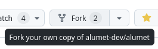

# Basic setup

## Prerequisites

Before attempting anything, please check that you have a recent version of the Rust toolchain (**at least 1.76** for now). You can run `rustc --version` to check your version. The easiest way to install a recent version of Rust is to use [rustup](https://rustup.rs/).

## Creating the plugin crate

The first thing to do is to initialize a new [crate](https://doc.rust-lang.org/book/ch07-01-packages-and-crates.html) for the plugin. Alumet plugins are not executables by themselves, they are library crates.

You have two options:
1. fork the official Alumet repository and develop there (best if you want to contribute to Alumet)
2. work in your own repository (best if you want to be independent)

### Creating the plugin in a fork of the official repository

Fork the Alumet repository on GitHub.



Clone your fork with `git clone` and open the root directory of Alumet.

You should see several files and folders:

```bash
.
├── Cargo.lock
├── Cargo.toml
├── LICENSE
├── LICENSE.fr.txt
├── README.md
├── alumet/
├── app-agent/
├── plugin-csv/
├── plugin-nvidia/
├── plugin-rapl/
├── plugin-relay/
├── target/
├── ...
```

Let's make a crate for your plugin! By convention, plugins contained in the main repository should be prefixed with `plugin-`:

```bash
cargo init --lib plugin-example
```

This will create a new directory named `plugin-example`, with some files in it.
Cargo should also modify the root `Cargo.toml` to add your plugin to the list of `members`, like this:

```toml
members = [
    "alumet",
    # ... other crates here
    # the line below has been added automatically
    "plugin-example",
]
```

Finally, use `cargo add` to declare some dependencies. Every plugin needs to depend on at least `alumet` and `anyhow`. We also add `log` to display nice log messages (avoid `println!` in Alumet!).

```sh
cargo add alumet anyhow log
```

Make sure that the `alumet` dependency is local and does _not_ include a version number:

```toml
[package]
name = "plugin-example"
version = "0.1.0"
edition = "2021"

[dependencies]
alumet = { path = "../alumet" } # LOCAL + NO VERSION
anyhow = "1.0"
log = "0.4"
```

### Creating the plugin in a separate repository

Initialize a crate with cargo:

```bash
cargo init --lib plugin-example
```

Finally, use `cargo add` to declare some dependencies. Every plugin needs to depend on at least `alumet` and `anyhow`. We'll also add `log` to display nice log messages (avoid `println!` in Alumet!).

```sh
cargo add alumet anyhow log
```

Since your plugin is not in the main repository of Alumet, the dependency on `alumet` will _not_ be local, but rather downloaded from `crates.io`.

## Coding - v0.1

Now, the fun part: let's code your plugin!

### Plugin Structure

Open the `lib.rs` file in your plugin source directory. For now, it contains a minimal library generated by `cargo init`. You will replace it with a minimal Alumet plugin.

To define a (static) Alumet plugin, you just need two things:
- a structure
- an implementation of the `AlumetPlugin` trait for this structure

Here is what it looks like:
```rust,ignore 
{{#rustdoc_include ../../../code/plugin_example/src/basic.rs}}
```

Note that **the plugin structure is public**. It needs to be, otherwise agents (executable applications that perform the measurements with Alumet) won't be able to use the plugin. For now, the structure is empty. It can contain anything you want, in particular configuration options. We will show an example later.

### Running your plugin

To try your plugin, you need to modify an Alumet _agent_ so that it loads the plugin on startup.

If you develop your plugin outside of the main Alumet repository, you probably have your own agent, maybe based on a local copy of official Alumet agents. If you develop your plugin in the main Alumet repository, here is what you need to do:
1. Choose an agent to modify.
2. Add your plugin as a dependency of the agent.
3. Edit one or two lines or code to make the agent load your plugin.

For this tutorial, we will modify the "local" agent, which works on its own (unlike the relay mode for instance). In the Alumet repository, open a Terminal in the `app-agent` folder.

Add your plugin to dependencies of the agent:
```sh
cargo add plugin-example
```

Open `app-agent/src/bin/local.rs` and add your plugin to the list of plugins. For a first test, you can remove other plugins in order to see the messages of your plugin more easily. Let's keep the CSV plugin, though. It will be useful to see what the measurements produced by your plugin (in the next steps of the tutorial).
```diff
let plugins = static_plugins![
-    plugin_rapl::RaplPlugin,
-    // ... (other plugins)
+    plugin_example::ExamplePlugin,
    plugin_csv::CsvPlugin,
];
```

Note: with cargo, we use the name that we declared for the crate, `plugin-example` (look at `plugin-example/Cargo.toml`), but in code we use `plugin_example`. This is because hyphens are not valid characters in Rust identifiers, hence they are converted to underscores.

Finally, you can test your plugin! Run the local agent:
```sh
cargo run --bin alumet-local-agent --features local_x86
```

You should see your plugin in the list of enabled plugins, and it should print the message `Hello!` (from its `start` method).
<!-- TODO asciinema -->

Stop the agent with Ctrl+C. Your plugin should print the message `Bye!` (from its `stop` method).
