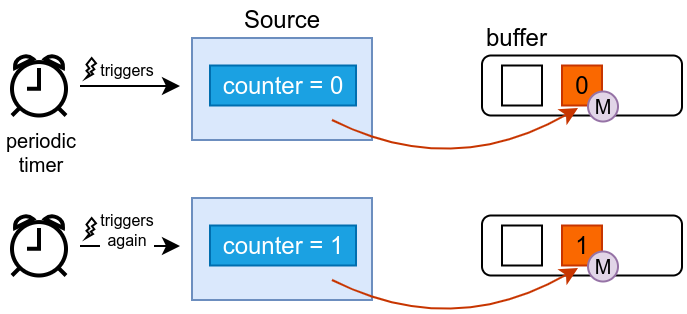
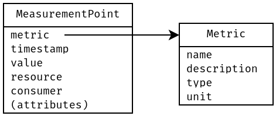

# Measuring with sources

For the moment, your plugin doesn't measure anything.
You will now write your first "source" in order to obtain measurement points, that will be passed to the rest of the Alumet pipeline.

For your first source, you will implement a simple counter that measures the number of times it has been polled.

## Counter source: the idea

The counter source works in the following way.

It has an internal state: the current value of the counter.
The Alumet framework manages a timer and periodically triggers the source.
When triggered, the source creates a _measurement point_ containing the counter's value and appends it to a buffer provided by Alumet.
The framework then passes the data to the rest of the measurement pipeline.



To distinguish the values of the counter from other unrelated measurements (such as the data produced by other sources), each _measurement point_ must indicate its _metric id_.
The _metric id_, represented by the rounded **(M)** on the diagram, indicates what "object" is being measured.
Your plugin must create a new metric on startup (see below), store its id somewhere, and use in to produce _measurement points_.

## Defining a metric

### What is a metric?

Alumet can manage a large number of measurements that come from different sources implemented in multiple plugins.
Its measurement pipeline does not carry raw values, but _measurement points_ which contain some metadata in addition to the raw value.

In particular, we want to know what "object" is being measured, what kind of information is obtained: is it the temperature of an ACPI sensor? The energy consumed by the CPU? The memory reserved by a process? What is the associated unit? This knowledge is stored in a _metric_.

Alumet offers a standard way of defining metrics, in a way that makes all the measurements useful and rigorous.
As explained [in the docs](https://docs.rs/alumet/latest/alumet/metrics), a metric is defined by:
- a **unique name**
- a **unit** of measurement (is it energy? time?) - Alumet follows the [UCUM (Unified Code for Units of Measure) standard](https://ucum.org/ucum).
- a **type** of measured value (is it an integer? a float?)
- a textual **description**

For efficiency reasons, Alumet assigns a unique id to every metric, and uses this id instead of the full definition or name.
Each _measurement point_ hence contains a _metric id_.

### Creating a metric

Okay, let's think about the metric that you need for your counter source.

- **name**: We'll call it `example_source_call_counter`, which reflects what we measure: we count how many times the source has been called by Alumet
- **unit**: Since this is a simple counter, it has no unit! In the UCUM, this corresponds to the "unity" unit.
- **type**: Integer, here we choose `u64` to keep it simple.
- **description**: Something short and explicit, for example `"number of times the example source has been called"`.

To register this new metric in Alumet, call `create_metric` in the `start` method of your plugin.

```rust,ignore 
{{#rustdoc_include ../../../code/plugin_example/src/basic_with_elements.rs:plugin_start_head}}
{{#rustdoc_include ../../../code/plugin_example/src/basic_with_elements.rs:create_source_metric}}
{{#rustdoc_include ../../../code/plugin_example/src/basic_with_elements.rs:plugin_start_tail}}
```

If all goes well, you obtain a `TypedMetricId` that you can use to refer to the metric at every step of the Alumet pipeline, in particular in a source.

<div class="warning">

Creating a metric may fail in case of a duplicate name (note the `?` that handles the potential error - we'll talk about it later).

Therefore, you **should not** choose names that are too generic.
Instead, you **should** choose explicit and precise names.
If applicable, include some information about the kind of sensor.

Here are some examples:
- bad metric names (too vague): `metric`, `counter`, `measured_energy`
- good metric names: `acpi_zone_temperature`, `rapl_consumed_energy`, `estimated_gpu_power`, `kernel_cpu_usage`
</div>

### More than metrics

Sometimes, we need a scope that is more precise than the metric definition.
For instance, when measuring the use of the CPU by the OS kernel, we are interested in knowing the value per CPU core.

This could be implemented by creating one metric for each case: `kernel_cpu_usage_core0`, `kernel_cpu_usage_core1`, ...
Some monitoring software use this strategy (such as `collectd`).
However, it is is too limiting: it complicates the operations that you can apply on the data (think of filters, aggregates, etc.), and it does not scale well when you have multidimensional information to add to the measurements (CPU core id, hostname, etc.).

Therefore, we have chosen a different model for Alumet.
First, arbitrary key-value pairs can be attached to a measurement point. We call them _attributes_.
Second, two common pieces of information are always present in a measurement point: the _resource_ and _resource consumer_.

- An **attribute** is a key-value pair that can be attached to a measurement point. Its content is completely arbitrary.
- A **resource** is something that can be "utilized" or "consumed". It is usually related to a piece of hardware. For example, CPU cores and RAM are _resources_ to Alumet.
- A **consumer** is something that uses a resource. It is usually a software component. For example, a process is a _resource consumer_ to Alumet.

Attributes are optional, but the resource and consumer fields are mandatory.
To summarise, a measurement point looks like this:



## Defining a simple source

### Implementing the counter source

To define a source, define a structure and implement the `Source` trait on it (`alumet::pipeline::Source`).

The core of Alumet will automatically call the `poll` method when it is time to do so.
Each time a source is triggered (that is, its `poll` method is called), it can produce new measurement points and push them to the accumulator.

```rust,ignore
{{#rustdoc_include ../../../code/plugin_example/src/basic_with_elements.rs:source_partial0}}
    // TODO
{{#rustdoc_include ../../../code/plugin_example/src/basic_with_elements.rs:source_partial1}}
        todo!()
{{#rustdoc_include ../../../code/plugin_example/src/basic_with_elements.rs:source_partial2}}
```

To implement `poll`, follow these steps:
1. Measure, i.e. obtain the measurements.
    Here, we will simply increment a counter. The counter is part of the state of the source, hence it will be a field in the `ExampleSource` structure.
2. Create one `MeasurementPoint` for every measured value.
    To do that, we need to know which metric we are measuring. The previously obtained `TypedMetricId` will be another field of the `ExampleSource` structure.
3. Push the points to the `MeasurementAccumulator`.

```rust,ignore
{{#rustdoc_include ../../../code/plugin_example/src/basic_with_elements.rs:source}}
```

Since our counter is not related to a particular _resource_ nor _consumer_, we use the special value `LocalMachine`.
It indicates that it's a "global" measurement, with the whole machine as a scope (here, "machine" is intentionnaly not precisely defined: if you're in a VM, it represents the VM, if you're running on a bare-metal node, it's this node).

### Registering the counter source

Now that you have defined a source, you need to create it and add it to the Alumet pipeline with `add_source`.
Do this in the `start` method of your plugin.

```rust,ignore
{{#rustdoc_include ../../../code/plugin_example/src/basic_with_elements.rs:plugin_start}}
```
