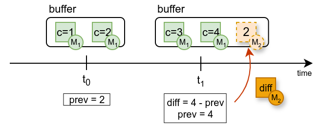

# Transforming measurements

At this point, you have a plugin that produces measurements with a source.
The next step in the [measurement pipeline](../../intro/Alumet%20architecture.md) is the **transform** step.
It sees all the measurement points produced by the sources, can filter them, modify them and compute new values.

In your first source, the "counter", you produced a measurement that contained the number of times that the source was called. This number was always growing.
It corresponded to the metric `example_source_call_counter`.

For your first transform, you will use the values produced by this source and compute the difference between each value of the counter.

> **🚧 Work in progress**
>
> For the moment, you are a little "alone" when writing transforms: the API is rather low-level.
> We are working on a more friendly API, built in Alumet, that will simplify the implementation of transforms that need to work on specific metrics.
> You can share your use case and wishes with us in the [Discussions](https://github.com/alumet-dev/alumet/discussions).

## Difference transform: the idea

The "difference" transform works in the following way.

It has an internal state: the previous value of the counter.
Alumet periodically triggers the "counter" source and passes the measurement buffer to your transform, which can inspect and modify it. It will find the value of the counter, **c**, and compute the difference with the previously known value (if there is one).


Here is a simplified timeline of the transform's operations. In reality, a single buffer can contain multiple updates of the counter, and each of them need to be taken into account.


The measurement points produced by the transform are associated with the new metric **(M2)**, which we will define as explained in [chapter 2](./2_measuring.md). Measurement points produced by the "counter" source use a different metric, schematically called **(M1)** in the diagrams.

## Implementation

Define a structure and implement the `Transform` trait on it (`alumet::pipeline::Transform`).

```rust,ignore
{{#rustdoc_include ../../../code/plugin_example/src/basic_with_elements_empty.rs:transform}}
```

In the transform structure, we need the following fields:
- An integer to store the previous value of the counter. On the first time, there is no previous value, hence we use `Option<u64>`.
- The id of the metric associated with the counter. This will allow the transform to find the right values if multiple metrics are present in the incoming buffer (which is often the case in a realistic setup).
- The id of the metric associated with the difference. We will use it to construct the new measurement points.

```rust,ignore
{{#rustdoc_include ../../../code/plugin_example/src/basic_with_elements.rs:transform_struct}}
```

In `apply`, we find all the relevant points, compute the difference and update the internal state.

```rust,ignore
{{#rustdoc_include ../../../code/plugin_example/src/basic_with_elements.rs:transform_impl}}
```

## Creation and Registration

The transform is now implemented, let's use it.

To build the transform, you first need a new metric, which you must create in `start` as follows:
```rust,ignore
{{#rustdoc_include ../../../code/plugin_example/src/basic_with_elements.rs:create_transform_metric}}
```

Then, you can create the transform structure, and add it to the pipeline with `add_transform`.
Note that this is similar to the registration of sources.

```rust,ignore
{{#rustdoc_include ../../../code/plugin_example/src/basic_with_elements.rs:add_transform}}
```


Here is the full `start` method after this modification.

```rust,ignore
{{#rustdoc_include ../../../code/plugin_example/src/basic_with_elements.rs:plugin_start_head}}

{{#rustdoc_include ../../../code/plugin_example/src/basic_with_elements.rs:create_source_metric}}

{{#rustdoc_include ../../../code/plugin_example/src/basic_with_elements.rs:create_transform_metric}}

{{#rustdoc_include ../../../code/plugin_example/src/basic_with_elements.rs:add_source}}

{{#rustdoc_include ../../../code/plugin_example/src/basic_with_elements.rs:add_transform}}

{{#rustdoc_include ../../../code/plugin_example/src/basic_with_elements.rs:plugin_start_tail}}
```
