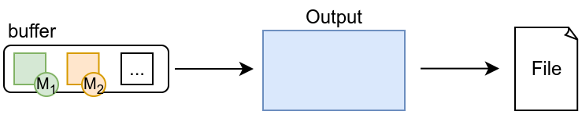

# Writing with outputs

The last step of the [measurement pipeline](../../intro/Alumet%20architecture.md#measurement-pipeline) is to export the measurements with an output.

In this chapter, you will implement an output that writes the measurements to a file with a simple textual format.

## Text output: the idea

Like transforms, outputs are automatically triggered by Alumet when they need to process some measurements.
The text output will look at every measurement point and write the data to a file.



## Implementation

Define a structure and implement the `Output` trait on it (`alumet::pipeline::Output`).

```rust,ignore
{{#rustdoc_include ../../../code/plugin_example/src/basic_with_elements_empty.rs:output}}
```

For efficiency reasons, we open the File only once, on startup, and wrap it in a buffered writer.
We store the writer in the output.

```rust,ignore
{{#rustdoc_include ../../../code/plugin_example/src/basic_with_elements.rs:output_struct}}
```

In `write`, we loop on the measurements, build a string with the fields we want to save, and write it to the file.
Some fields, such as the `timestamp`, cannot be directly converted to a nice human-readable string, therefore they are converted to a more appropriate type.

Regarding the `metric`, we could print its `id`, but:
1. It means nothing to the end user.
2. It is not guaranteed to be stable (it can change depending on the plugins that are enabled, the exact version of the framework, etc.).

Usually, the preferred way to deal with this issue is to use the **metric name** instead.
While not directly available in the measurement point, it can be obtained from the `OutputContext`, as shown below.

```rust,ignore
{{#rustdoc_include ../../../code/plugin_example/src/basic_with_elements.rs:output}}
```

## Registration

In `start`, open the file in write mode, create the output and add it to the pipeline.
Because we are using the standard file API, which is blocking, we use `add_blocking_output`.
This tells Alumet to avoid mixing this output with non-blocking asynchronous tasks, which could prevent them from running properly while the output waits for I/O operations.

```rust,ignore
{{#rustdoc_include ../../../code/plugin_example/src/basic_with_elements.rs:add_output}}
```

## Recap

Here is the full `start` method with the metrics, source, transform and output.

```rust,ignore
{{#rustdoc_include ../../../code/plugin_example/src/basic_with_elements.rs:plugin_start}}
```
